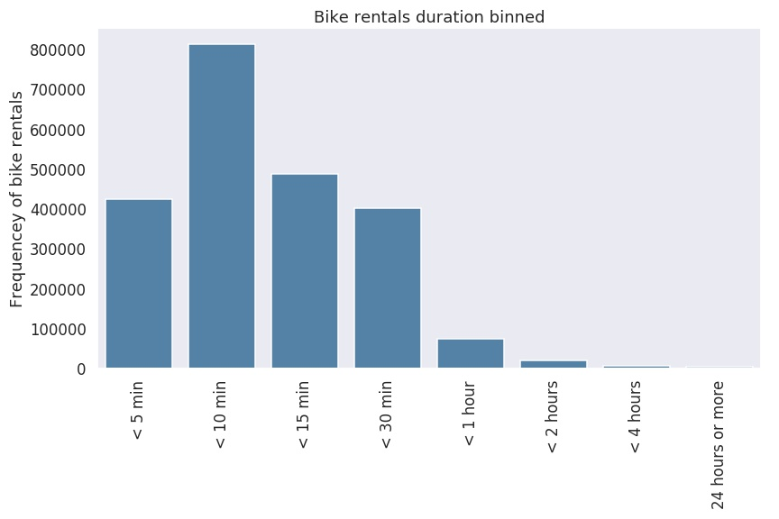

# Communicate Data Findings

This will perform data analysis on information about individual rides made in a bike-sharing system covering the greater San Francisco Bay area.

[Ford GoBike System Data](https://www.google.com/url?q=https://www.fordgobike.com/system-data&sa=D&ust=1554231885608000)

This project was done as part of my enrollment in [Data Analyst Nanodegree](https://udacity.com/course/data-analyst-nanodegree--nd002) program by [Udacity](https://udacity.com/)

[fordgobike-analysis.ipynb](fordgobike-analysis.ipynb) is the Jupyter Notebook that contains the Data Analysis.

[fordgobike-analysis.slides.html](fordgobike-analysis.slides.html) is a Slide Deck created from the finding from the Jupyter Notebook.

## Dataset

I have chosen to perform data analysis on the [Ford GoBike's trip data for public use](https://www.fordgobike.com/system-data) 
and the analysis was performed on the files that contains data between january  2018 until february 2019.

## Summary of Findings

Bike rentals mostly occurs on business weekdays with peek bike trips on tuesday, wednesday, and thursdays.
When segmenting the bike trips on user type a different pattern is revealed for customers. They have an increase rental frequency on saturdays.


## Key Insights for Presentation

Customer user type account for 14 % of bike rentals with an increase of rentals on saturdays. 
One explanation could be that the Customer user type consist of weekend tourists visiting the San Francisco Bay area.

The most common bike trips is less than 10 minutes


## Running Jupyter Notebook

This data analysis is done with Python and Jupyter Notebook. Third party library dependencies can be installed with pip and the requirements.txt

Start jupyter notebook from the command line with the following command:

```bash
$ jupyter notebook
```

Expect a new browser tab to open with a list of items.
Select the `fordgobike-analysis.ipynb` to open the data analysis notebook.  


### Slide Deck

To convert the notebook to a slide deck issue the following command:

```bash
$ jupyter nbconvert fordgobike-analysis.ipynb --to slides --template output_toggle.tpl --post serve
```

Expect file `fordgobike-analysis.slides.html` to be created.

### Resources used

* [Seaborn](https://seaborn.pydata.org/index.html)
* [Matplotlib](https://matplotlib.org)
* [Pandas for Everyone: Python Data Analysis](http://www.informit.com/store/pandas-for-everyone-python-data-analysis-9780134546933) by Daniel Y. Chen
* Jupyter Notebook [Toggle Template](http://www.damian.oquanta.info/posts/hide-the-input-cells-from-your-ipython-slides.html) for Slides by Damian Avila
