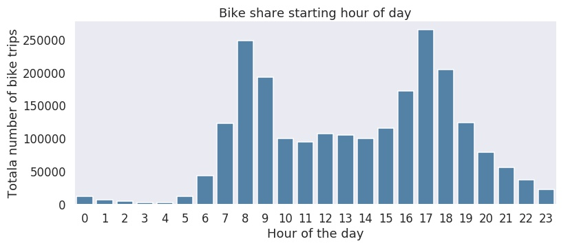

# Communicate Data Findings

This will perform data analysis on information about individual rides made in a bike-sharing system covering the greater San Francisco Bay area.

[Ford GoBike System Data](https://www.google.com/url?q=https://www.fordgobike.com/system-data&sa=D&ust=1554231885608000)

This project was done as part of my enrollment in [Data Analyst Nanodegree](https://udacity.com/course/data-analyst-nanodegree--nd002) program by [Udacity](https://udacity.com/)

[fordgobike-analysis.ipynb](fordgobike-analysis.ipynb) is the Jupyter Notebook that contains the Exploratory Data Analysis, [html](https://marcusholmgren.github.io/bikeshare-analysis/fordgobike-analysis.html).

[fordgobike-slide_deck.ipynb](fordgobike-slide_deck.ipynb) is the Jupyter Notebook that contains the Explanatory Data Analysis, [html](https://marcusholmgren.github.io/bikeshare-analysis/fordgobike-slide_deck.html).

[docs/fordgobike-slide_deck.slides.html](https://marcusholmgren.github.io/bikeshare-analysis/fordgobike-slide_deck.slides.html#/) is a Slide Deck created from the finding from the explanatory data analysis.

## Dataset

I have chosen to perform data analysis on the [Ford GoBike's trip data for public use](https://www.fordgobike.com/system-data) 
and the analysis was performed on the files that contains data between january  2018 until february 2019.

## Summary of Findings

Most bike trips are shorter than 30 minutes and the most common is that it is shorter than 10 minutes.

Bike rentals mostly occurs on business weekdays with peek bike trips on tuesday, wednesday, and thursdays.
When segmenting the bike trips on user type a different pattern is revealed for casual customers. They have an increase rental frequency on weekends.

There are two distinct hours during the day that have higher utilization of bikes.


## Key Insights for Presentation

Customer user type account for 14 % of bike rentals with an increase of rentals on saturdays. 
One explanation could be that the Customer user type consist of weekend tourists visiting the San Francisco Bay area.

### 1. How long is the typical bike trip duration?  

The bike rental duration contains some extreme values. But the most common bike rental is less than 10 minutes in lenght.


### 2. During what days of the week does bike rentals occur?  

Bike rentals mostly occurs on business weekdays with peek bike trips on tuesday, wednesday, and thursdays.


### 3. Same station start and end bike trips

When looking at bike trips that start and end at the same station there is a interesting pattern that is revealed in the Customer user type.
They have a higher number of these kind of trips than the regular Subscribers.
I interpret this as it could be weekend tourists visiting the San Francisco Bay area and are doing more sightseeing kind of trips close to the hotel where they are staying.
Than the commuting style usage pattern that the regular Subscribers have.

### 4. Bike rental hour of the day

There is a distinct pattern with two spikes of bike rentals during the day.
One in the morning at 8 o'clock and then later in the evening at 17 o'clock.
This is a really good fit with a commuter pattern with people using bike rentals to travel to and from work. 


## Running Jupyter Notebook

This data analysis is done with Python and Jupyter Notebook. Third party library dependencies can be installed with pip and the requirements.txt

Start jupyter notebook from the command line with the following command:

```bash
$ jupyter notebook
```

Expect a new browser tab to open with a list of items.
Select the `fordgobike-analysis.ipynb` to open the data analysis notebook or `fordgobike-slide_deck.ipynb` for the explanatory data analysis notebook.  


### Slide Deck

To convert the explanatory data analysis notebook to a slide deck issue the following command:

```bash
$ jupyter nbconvert fordgobike-slide_deck.ipynb --to slides --template output_toggle.tpl --post serve
```

Expect file `fordgobike-slide_deck.slides.html` to be created.

### Resources used

* [Seaborn](https://seaborn.pydata.org/index.html)
* [Matplotlib](https://matplotlib.org)
* [Pandas for Everyone: Python Data Analysis](http://www.informit.com/store/pandas-for-everyone-python-data-analysis-9780134546933) by Daniel Y. Chen
* Jupyter Notebook [Toggle Template](http://www.damian.oquanta.info/posts/hide-the-input-cells-from-your-ipython-slides.html) for Slides by Damian Avila
